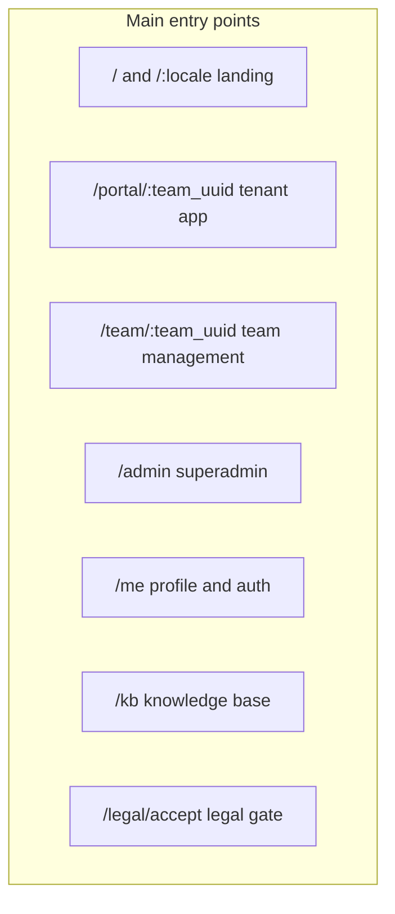

# Building an App with All BeeGoodIT Packages

This guide walks you from a new Laravel app to a Filament application using every BeeGoodIT package and the patterns in [PATTERNS.md](PATTERNS.md). Follow sections in order; the dependency graph in [USAGE-GUIDELINES.md](USAGE-GUIDELINES.md) defines the install order.

---

## Prerequisites (version block)

| Requirement | Version |
|-------------|---------|
| PHP | 8.4+ |
| Laravel | 12+ |
| Filament | 5+ |
| Composer | 2.x |
| Node | 18+ (for Filament/Vite) |

Ensure your app meets these before running any command or applying code from this guide.

---

## Paths (what to follow)

- **Minimal**: Section 0 → 1 → 2 (foundation packages only: file-storage, eloquent-userstamps, filament-i18n, laravel-cookie-consent, filament-legal, filament-knowledge-base, laravel-pwa, laravel-feedback). Skip tenancy and OAuth.
- **With tenancy**: Add Section 3 (filament-tenancy, filament-user-avatar, filament-user-profile, filament-social-links). Optionally add Section 5 (tenancy-roles, tenancy-domains, filament-connect).
- **With OAuth**: Add filament-user-avatar (Section 3) then Section 4 (filament-oauth).
- **Full**: Follow all sections 0–6 in order.

Each step and package below includes an **Expected outcome** so you can verify the default setup: a fixed URL (e.g. `/kb`), something visible in the UI (e.g. banner, resource in sidebar), or a behavior you can check (e.g. DB columns populated).

---

## Main features of the full app

When you complete the full setup (all sections 0–5), the app has the following main features. Paths below use the recommended default layout: `/portal/:team_uuid` (tenant app), `/team/:team_uuid` (team management), `/admin` (superadmin), `/` and `/:locale` (landing).

| Feature | What it does | Where / path (default) |
|--------|----------------|-------------------------|
| **Landing** | Redirect to locale; localized landing page | `/` → `/:locale`; `/:locale` (e.g. `/en`, `/de`) |
| **Portal (tenant app)** | App business logic per tenant; tenant switcher, branding | `/portal/:team_uuid` (Filament panel `path('portal')` + tenant) |
| **Team management** | Register new team; edit team profile (name, slug, logo, colors) | `/team/:team_uuid` (Filament panel `path('team')` + tenant; Register team, Edit team profile) |
| **Superadmin** | Platform-wide admin (no tenancy) | `/admin` (Filament panel `path('admin')`) |
| **Profile management** | User profile, password, appearance (locale/timezone/time format), 2FA, notifications | `/me` (user profile panel) |
| **Unified auth** | Login and (optional) registration; OAuth (e.g. Microsoft, Discord) callbacks | `/me/login`, `/me/register` (if enabled), `/me/oauth/callback/{provider}` |
| **i18n** | User locale, timezone, 12/24h preference; app/panel reflects them | Settings in `/me` (appearance); applied app-wide |
| **Cookie banner** | GDPR-compliant cookie consent on front-end | Banner on pages where the view/component is included |
| **Legal** | Privacy policy, imprint, cookie policy; versioned; acceptance gate | `/legal/accept` (acceptance screen); Legal Policy / Legal Identity resources in panel |
| **Knowledge base** | Documentation panel from Markdown (e.g. `docs/knowledge-base`) | `/kb` |
| **PWA** | Install prompt, manifest, service worker, push notifications | Manifest/service worker as per config; push open often `/me/notifications` |
| **Feedback** | Submit feedback from the UI; manage feedback in admin | Feedback button in every Filament panel navbar; FeedbackItem resource in panel |
| **User avatar** | Upload and display user avatar | In panel navbar / user menu (no dedicated URL) |
| **Social links** | Polymorphic social links (e.g. per team or user) | Social Platforms / Social Links resources or relation manager in panel |
| **Tenancy roles** | Team roles (owner, admin, member); authorization helpers | No URL; `$user->isTeamAdmin($team)` etc.; role in membership/team UI if exposed |
| **Tenancy domains** | Domain/subdomain per tenant; optional verification | Domain relation manager on tenant resource in panel |
| **Connect** | Per-tenant API credentials (tokens, keys) | Connect resource in panel; `Connect::get('key')` in code |
| **File storage** | S3/local with automatic URL generation for stored files | Backend only; `$model->getXxxUrl()` |
| **Userstamps** | Track creator/updater on models | Backend only; `created_by_id` / `updated_by_id` |



---

## 0. Prerequisites and baseline app

### 0.1 Create the application

Use Laravel 12 with Livewire and Pest, without starter-kit authentication (you will add Filament auth or Breeze later):

```bash
nvm use 22
laravel new my-app --no-authentication --livewire --pest
cd my-app
```

Then install Filament 5 and create at least one admin panel:

```bash
composer require filament/filament:"^5.0"
php artisan filament:install --panels --notifications
```

Create an admin user when prompted, or run `php artisan make:filament-user` later. The default panel is at `/admin`. (Filament 5 is recommended for new apps with Laravel 12 and Livewire 4; BeeGoodIT packages support both. Use `filament/filament:"^4.0"` instead of `^5.0` if you need to stay on Filament 4.)

**Optional:** Add [Laravel Boost](https://laravel.com/docs/12.x/boost) for AI-assisted development (MCP, guidelines). See [PATTERNS.md – Add Laravel Boost](PATTERNS.md#add-laravel-boost-optional).

- Set up authentication (Filament’s built-in auth or Laravel Breeze). Ensure an `User` model exists.
- **Tenancy baseline** (required for Section 3 tenancy and Section 5): You need a `Team` model and tables `teams` and `team_user`. Either (a) use [filament-tenancy’s published migrations](packages/filament-tenancy/README.md#1-publish-migrations) (creates `teams` and `team_user` and adds branding columns; for fresh Laravel), or (b) create the model and migrations yourself / use a starter (e.g. Laravel Breeze with teams). Then configure your Filament panel with `->tenant(Team::class)` and, if desired, tenant registration and profile pages (Section 3.1). If you skip tenancy, skip Section 3 tenancy packages and all of Section 5.

- **Recommended panel and route defaults** (see [PATTERNS.md – Default routes and panels](PATTERNS.md#default-routes-and-panels)): Use three panels – admin at `path('admin')` (superadmin, no tenancy), portal at `path('portal')` (tenant app, `tenant(Team::class)`), team at `path('team')` (team management, `tenant(Team::class)` with RegisterTeam / EditTeamProfile). Landing: `/` redirect to `/:locale`; `/:locale` serves the landing page. Filament tenant URLs become `/portal/{tenant}` and `/team/{tenant}` (tenant = team uuid or slug depending on Team’s route key).

- **Expected outcome:** App runs; you can open the Filament panel and log in. If tenancy: you can switch or register a tenant and see tenant-scoped content.

---

## 1. App foundation (patterns, no packages)

Apply these before or alongside the packages. Full details: [PATTERNS.md](PATTERNS.md).

### 1.1 Force HTTPS in production

**Configure:** `app/Providers/AppServiceProvider.php`

```php
public function boot(): void
{
    if (config('app.env') === 'production') {
        \Illuminate\Support\Facades\URL::forceScheme('https');
    }
}
```

- **Expected outcome:** In production, visiting `http://...` redirects to `https://...`.

### 1.2 UUIDs (new apps)

**Model:** Add `HasUuids` to `User` and `Team` (and any other models using UUIDs).

```php
use Illuminate\Database\Eloquent\Concerns\HasUuids;

class User extends Authenticatable
{
    use HasUuids;
}
```

**Migrations:** Use `$table->uuid('id')->primary()` and uuid foreign keys. See [PATTERNS.md](PATTERNS.md) for pivot tables and existing-table conversion.

- **Expected outcome:** User and Team (and related tables) use uuid primary keys; no integer `id`.

### 1.3 Filesystem / S3

**Configure:** `.env` and `config/filesystems.php` (Laravel default). For automatic URL generation (signed S3, public local), use `beegoodit/laravel-file-storage` in Section 2.

- **Expected outcome:** (Optional) When using S3, `.env` and `config/filesystems.php` point to your S3 disk.

---

## 2. Foundation packages (layer 1)

Install in any order; no beegoodit package dependencies.

### 2.1 laravel-file-storage

Unified S3/local file storage with automatic URL generation. Required by filament-user-avatar and filament-tenancy.

- **Requires:** None (see section 2).
- **Install**

```bash
composer require beegoodit/laravel-file-storage
```

- **Publish:** None (no config or migrations to publish).
- **Configure:** Use the `HasStoredFiles` trait on models that store file paths; set `$storedFiles` to the attribute names (e.g. `['avatar', 'logo']`).
- **Model:** e.g. `User` or `Team`: `use BeeGoodIT\LaravelFileStorage\Models\Concerns\HasStoredFiles;` and `protected $storedFiles = ['avatar'];`. Then use `$model->getAvatarUrl()` etc.

- **Expected outcome:** No UI. Models using `HasStoredFiles` return a valid URL from `getXxxUrl()` (e.g. `$user->getAvatarUrl()`).

Full setup: [packages/laravel-file-storage/README.md](packages/laravel-file-storage/README.md)

### 2.2 eloquent-userstamps

Track who created and last updated records.

- **Requires:** None (see section 2).
- **Install**

```bash
composer require beegoodit/eloquent-userstamps
```

- **Publish**

```bash
php artisan vendor:publish --tag=eloquent-userstamps-migrations
```

Edit the published migration: replace the placeholder table name with your table(s), add `created_by_id` and `updated_by_id` (uuid or foreignId as appropriate). Run `php artisan migrate`.
- **Configure:** None.
- **Model:** Add `use BeeGoodIT\EloquentUserstamps\HasUserStamps;` to any model that should track creator/updater.

- **Expected outcome:** No UI. Creating or updating a model that uses the trait fills `created_by_id` and `updated_by_id`.

Full setup: [packages/eloquent-userstamps/README.md](packages/eloquent-userstamps/README.md)

### 2.3 filament-i18n

User locale, timezone, and time format preferences.

- **Requires:** None (see section 2).
- **Install**

```bash
composer require beegoodit/filament-i18n
```

- **Publish**

```bash
php artisan vendor:publish --tag=filament-i18n-migrations
php artisan migrate
```

Optional: `--tag=filament-i18n-config`, `--tag=filament-i18n-lang`.
- **Configure:** Register middleware in `bootstrap/app.php`: append `\BeegoodIT\FilamentI18n\Middleware\SetLocale::class` to the web middleware stack.
- **Model:** Add `use BeeGoodIT\FilamentI18n\Models\Concerns\HasI18nPreferences;` and fillable `locale`, `timezone`, `time_format` on `User`.

- **Expected outcome:** User has locale, timezone, and time format; the app or panel reflects them (e.g. panel in the user’s locale).

Full setup: [packages/filament-i18n/README.md](packages/filament-i18n/README.md)

### 2.4 laravel-cookie-consent

GDPR-compliant cookie consent banner.

- **Requires:** None (see section 2).
- **Install**

```bash
composer require beegoodit/laravel-cookie-consent
```

- **Publish**

```bash
php artisan vendor:publish --tag=cookie-consent-config
php artisan vendor:publish --tag=cookie-consent-views
```

- **Configure:** Adjust `config/cookie-consent.php` as needed.
- **View:** Add the cookie consent component to your main layout (e.g. `@include('cookie-consent::index')` or as per package docs).

- **Expected outcome:** Cookie consent banner is visible on front-end pages where the view/component is included.

Full setup: [packages/laravel-cookie-consent/README.md](packages/laravel-cookie-consent/README.md)

### 2.5 filament-legal

Centralized legal compliance (privacy policy, imprint, etc.).

- **Requires:** None (see section 2).
- **Install**

```bash
composer require beegoodit/filament-legal
```

- **Publish:** Migrations are loaded automatically. Optional: `php artisan vendor:publish --tag=filament-legal-migrations` to publish and customize; `--tag=filament-legal-translations` for lang files.
- **Configure:** Register the Legal resource in your Filament panel and use the package middleware/routes as needed.
- **Panel:** Add the package’s Filament resource(s) to your panel and link legal pages from footer or panel.

- **Expected outcome:** Legal Policy and Legal Identity resources appear in the panel where you registered them; the acceptance route `/legal/accept` exists (when middleware is used, unaccepted users can be redirected there).

Full setup: [packages/filament-legal/README.md](packages/filament-legal/README.md)

### 2.6 filament-knowledge-base

Standardized Knowledge Base for Filament apps (wraps guava/filament-knowledge-base).

- **Requires:** None (see section 2). Composer pulls `guava/filament-knowledge-base` as dependency.
- **Install**

```bash
composer require beegoodit/filament-knowledge-base
```

- **Publish**

```bash
php artisan vendor:publish --tag=filament-knowledge-base-config
```

- **Configure:** Edit `config/filament-knowledge-base.php` and register the package’s pages/resources in your panel.
- **Panel:** Add the Knowledge Base page or resource to your Filament panel as per package docs.

- **Expected outcome:** Knowledge base panel is available at `/kb` (default path). Content comes from `docs/knowledge-base` (or your configured path).

Full setup: [packages/filament-knowledge-base/README.md](packages/filament-knowledge-base/README.md)

### 2.7 laravel-pwa

Progressive Web App support.

- **Requires:** None (see section 2).
- **Install**

```bash
composer require beegoodit/laravel-pwa
```

- **Publish**

```bash
php artisan vendor:publish --tag=pwa-config
php artisan vendor:publish --tag=pwa-migrations
php artisan migrate
```

- **Configure:** Edit `config/pwa.php` (app name, icons, etc.).
- **View:** Include the PWA meta and manifest in your layout as per package docs.

- **Expected outcome:** PWA manifest and service worker are available as per config; install prompt or "Add to home screen" can appear when configured.

Full setup: [packages/laravel-pwa/README.md](packages/laravel-pwa/README.md)

### 2.8 laravel-feedback

Feedback system with Filament integration.

- **Requires:** None (see section 2).
- **Install**

```bash
composer require beegoodit/laravel-feedback
```

- **Publish**

```bash
php artisan vendor:publish --tag=feedback-config
php artisan vendor:publish --tag=feedback-migrations
php artisan migrate
```

Optional: `--tag=feedback-lang`.
- **Configure:** Edit `config/feedback.php` if needed.
- **Panel:** Register the package’s Filament resource or page in your panel.

- **Expected outcome:** Feedback button appears in the Filament panel navbar (and optionally FeedbackItem resource in the panel); submitting feedback shows success and creates a record.

Full setup: [packages/laravel-feedback/README.md](packages/laravel-feedback/README.md)

---

## 3. Tenancy and file-dependent packages (layer 2)

Install after Section 2. Respect the “Requires” callouts.

### 3.1 filament-tenancy

Multi-tenancy with team branding and management. **Tenancy path.**

- **Requires:** beegoodit/laravel-file-storage (see section 2.1).
- **Install**

```bash
composer require beegoodit/filament-tenancy
```

- **Publish**

```bash
php artisan vendor:publish --tag=tenancy-migrations
php artisan migrate
```

- **Configure:** Panel: `->tenant(Team::class)`, `->brandName(fn () => filament()->getTenant()?->name ?? 'App')`, `->brandLogo(fn () => filament()->getTenant()?->getFilamentLogoUrl() ?? asset('images/logo.svg'))`, and register `RegisterTeam` / `EditTeamProfile` pages and tenant registration/profile.
- **Model:** Add `use BeegoodIT\FilamentTenancy\Models\Concerns\HasBranding;` to `Team` and ensure fillable includes `name`, `slug`, `logo`, `primary_color`, `secondary_color`, `oauth_provider`, `oauth_tenant_id`.

- **Expected outcome:** Panel shows tenant switcher; team logo and name appear in the brand when a tenant is selected; Register team and Edit team profile pages work.

Full setup: [packages/filament-tenancy/README.md](packages/filament-tenancy/README.md)

### 3.2 filament-user-avatar

User avatar upload and display. **OAuth path** (required by filament-oauth).

- **Requires:** beegoodit/laravel-file-storage (see section 2.1).
- **Install**

```bash
composer require beegoodit/filament-user-avatar
```

- **Publish**

```bash
php artisan vendor:publish --tag=user-avatar-migrations
php artisan migrate
```

- **Configure:** Config and disk for avatar storage as per package (defaults often sufficient).
- **Model:** Add the package trait to `User` and ensure the avatar column exists. Expose avatar in Filament (navbar/user menu) as per package docs.

- **Expected outcome:** User avatar appears in the panel (e.g. navbar or user menu); upload and display work.

Full setup: [packages/filament-user-avatar/README.md](packages/filament-user-avatar/README.md)

### 3.3 filament-user-profile

User profile settings pages (timezone, locale, etc.).

- **Requires:** beegoodit/filament-i18n (see section 2.3).
- **Install**

```bash
composer require beegoodit/filament-user-profile
```

- **Publish**

```bash
php artisan vendor:publish --tag=filament-user-profile-migrations
php artisan vendor:publish --tag=filament-user-profile-timezone-data
php artisan migrate
```

Optional: `--tag=filament-user-profile-config`, `--tag=filament-user-profile-lang`.
- **Configure:** Edit config if needed.
- **Panel:** Register the package’s profile page(s) in your panel.

- **Expected outcome:** User profile/settings panel is available at `/me` (default path); Profile, Password, Appearance (and optional 2FA) pages are accessible.

Full setup: [packages/filament-user-profile/README.md](packages/filament-user-profile/README.md)

### 3.4 filament-social-links

Polymorphic social media link management.

- **Requires:** beegoodit/eloquent-userstamps (see section 2.2).
- **Install**

```bash
composer require beegoodit/filament-social-links
```

- **Publish:** Migrations are loaded from the package. Optional: `php artisan vendor:publish --tag=filament-social-links-seeders` for seeders.
- **Configure:** Attach the polymorphic relation to the desired model (e.g. Team or User); ensure that model uses `HasUserStamps` if the package expects it.
- **Model:** Add the package’s relation/trait to the owner model. Register the resource or relation manager in Filament.

- **Expected outcome:** Social Platforms (and Social Links) resources or relation manager appear in the panel where registered; you can attach links to the configured owner model.

Full setup: [packages/filament-social-links/README.md](packages/filament-social-links/README.md)

---

## 4. OAuth (layer 3)

### 4.1 filament-oauth

OAuth2 authentication with optional team auto-assignment. **OAuth path.**

- **Requires:** beegoodit/filament-user-avatar (see section 3.2).
- **Install**

```bash
composer require beegoodit/filament-oauth
```

- **Publish**

```bash
php artisan vendor:publish --tag=filament-socialite-migrations
php artisan vendor:publish --tag=filament-oauth-migrations
php artisan vendor:publish --tag=filament-oauth-config
php artisan migrate
```

- **Configure:** Edit `config/filament-oauth.php` (and env) with OAuth provider credentials. If using tenancy, configure team auto-assignment (e.g. `oauth_provider` and `oauth_tenant_id` on Team).
- **Panel:** Register the package’s login/link and use the OAuth flow in your panel auth.

- **Expected outcome:** Login offers OAuth provider(s); after linking or authenticating, user (and tenant, if configured) are set correctly.

Full setup: [packages/filament-oauth/README.md](packages/filament-oauth/README.md)

---

## 5. Optional tenancy companions

Install only if using filament-tenancy (Section 3.1). These packages expect a Filament tenant (e.g. Team) and optionally `config('filament-tenancy.model')`.

### 5.1 filament-tenancy-roles

Role-based authorization for Filament multi-tenancy.

- **Requires:** filament-tenancy (see section 3.1) or equivalent Team/tenant setup. Not in composer; documentational dependency.
- **Install**

```bash
composer require beegoodit/filament-tenancy-roles
```

- **Publish:** None. Add a migration to add `role` (string, default `member`) to `team_user`.
- **Configure:** Ensure `config('filament-tenancy.model')` returns your Team model if used.
- **Model:** Add `InteractsWithTenantRoles` to `User` and `HasTenantRoles` to `Team` (package traits). Use `$user->isTeamOwner($team)`, `$user->hasTeamRole($team, ['admin'])`, etc.

- **Expected outcome:** User/Team role helpers work (e.g. `$user->isTeamAdmin($team)`); role is visible in membership/team UI if you expose it.

Full setup: [packages/filament-tenancy-roles/README.md](packages/filament-tenancy-roles/README.md)

### 5.2 filament-tenancy-domains

Polymorphic domain and subdomain management for tenants.

- **Requires:** filament-tenancy (see section 3.1) recommended as the tenant owner; not in composer.
- **Install**

```bash
composer require beegoodit/filament-tenancy-domains
```

- **Publish**

```bash
php artisan vendor:publish --tag=filament-tenancy-domains-config
```

Migrations are loaded from the package. Run `php artisan migrate`.
- **Configure:** Edit `config/filament-tenancy-domains.php` (e.g. `platform_domain`). Attach the Domain model to your Team (or other tenant) via polymorphic relation.
- **Panel:** Register the package’s relation manager or form component on the tenant resource.

- **Expected outcome:** Domain relation manager or form appears on the tenant resource; domains can be added and (if applicable) verified.

Full setup: [packages/filament-tenancy-domains/README.md](packages/filament-tenancy-domains/README.md) (if present; else see package source.)

### 5.3 filament-connect

Multi-tenant API credential management.

- **Requires:** filament-tenancy (see section 3.1) or equivalent; expects a Filament tenant. Not in composer.
- **Install**

```bash
composer require beegoodit/filament-connect
```

- **Publish**

```bash
php artisan vendor:publish --tag=filament-connect-migrations
php artisan migrate
```

- **Configure:** Configure the tenant model (e.g. Team) so the package can scope credentials to the current tenant.
- **Panel:** Register the package’s Filament resource. Use the `Connect` facade in app code to resolve credentials for the current tenant.

- **Expected outcome:** Connect resource appears in the panel; `Connect::get('key')` returns credentials for the current tenant.

Full setup: [packages/filament-connect/README.md](packages/filament-connect/README.md)

---

## 6. Summary and checklist

### 6.1 User model (typical traits/columns after full setup)

| Source | Trait / columns |
|--------|------------------|
| Laravel / PATTERNS | `HasUuids` |
| filament-i18n | `HasI18nPreferences`; `locale`, `timezone`, `time_format` |
| filament-user-avatar | Package trait; avatar column |
| filament-oauth | Nullable `password` (migration) |
| filament-user-profile | Optional 2FA columns (if published) |
| filament-tenancy-roles | `InteractsWithTenantRoles` |

### 6.2 Team model (typical traits/columns after full setup)

| Source | Trait / columns |
|--------|------------------|
| Laravel / PATTERNS | `HasUuids` |
| filament-tenancy | `HasBranding`; `slug`, `logo`, `primary_color`, `secondary_color`, `oauth_provider`, `oauth_tenant_id` |
| filament-tenancy-roles | `HasTenantRoles` |
| laravel-file-storage | `HasStoredFiles` with `$storedFiles = ['logo']` if using branding |

### 6.3 Panel config (typical customizations)

- `->tenant(Team::class)` (if tenancy)
- `->brandName(...)`, `->brandLogo(...)` (if filament-tenancy)
- `->tenantRegistration(RegisterTeam::class)`, `->tenantProfile(EditTeamProfile::class)` and corresponding pages
- Registration of package pages/resources: Legal, Knowledge Base, Feedback, User Profile, OAuth, Connect, Social Links, Tenancy Domains

### 6.4 Checklist (parseable)

Use this list in order; complete each before moving to the next. Verify using the expected outcomes in each section.

- [ ] **0. Prerequisites and baseline** – PHP 8.4+, Laravel 12+, Filament 5+; Laravel app + Filament panel + auth; optional Team and tenancy setup. *Verify:* Panel opens and you can log in; if tenancy, switch or register a tenant.
- [ ] **1. App foundation** – Force HTTPS; UUIDs on User/Team; S3/filesystem reminder. *Verify:* Outcomes in 1.1–1.3 (HTTPS redirect, uuid keys, S3 config if used).
- [ ] **2. Foundation packages** – laravel-file-storage, eloquent-userstamps, filament-i18n, laravel-cookie-consent, filament-legal, filament-knowledge-base, laravel-pwa, laravel-feedback. *Verify:* Outcomes in 2.1–2.8 (e.g. `/kb`, cookie banner, feedback button, Legal resources).
- [ ] **3. Tenancy and layer 2** – filament-tenancy, filament-user-avatar, filament-user-profile, filament-social-links (if desired). *Verify:* Outcomes in 3.1–3.4 (tenant switcher, avatar, `/me`, social links in panel).
- [ ] **4. OAuth** – filament-oauth (if desired). *Verify:* Login offers OAuth; user/tenant set after auth (outcome 4.1).
- [ ] **5. Optional tenancy** – filament-tenancy-roles, filament-tenancy-domains, filament-connect (if using tenancy). *Verify:* Outcomes in 5.1–5.3 (role helpers, domain manager, Connect resource).
- [ ] **6. Summary** – Confirm User/Team traits and panel config; use checklist above.
