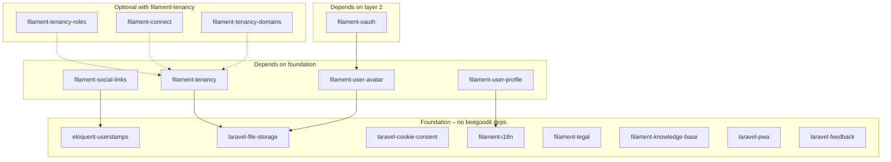

# Usage Guidelines: New Laravel/Filament App with BeeGoodIT Packages

This document analyzes package dependencies and provides a plan for a step-by-step guide to get a new Laravel/Filament app up and running as fast as possible using this monorepo.

---

## 1. Package dependency analysis

### 1.1 Composer (declared) dependencies

| Package | Depends on (beegoodit) |
|---------|------------------------|
| `beegoodit/filament-social-links` | `beegoodit/eloquent-userstamps` |
| `beegoodit/filament-user-profile` | `beegoodit/filament-i18n` |
| `beegoodit/filament-user-avatar` | `beegoodit/laravel-file-storage` |
| `beegoodit/filament-oauth` | `beegoodit/filament-user-avatar` |
| `beegoodit/filament-tenancy` | `beegoodit/laravel-file-storage` |

All other packages declare no `beegoodit/*` requires in `composer.json`.

### 1.2 Implicit / documented dependencies (not in composer)

- **filament-tenancy-roles**  
  Uses `config('filament-tenancy.model')` and expects a `team_user` pivot with a `role` column. README assumes a Team model and Filament tenancy. **Typically used with `beegoodit/filament-tenancy`** (or an app that mirrors that setup).

- **filament-connect**  
  README states: “Your tenant model (e.g., Team) … The package automatically filters credentials based on the current tenant in Filament.” **Designed for use with a Filament tenant (e.g. `filament-tenancy`).**

- **filament-tenancy-domains**  
  Polymorphic domain/subdomain management; can attach to any model. **Often used with a tenant model (e.g. Team from filament-tenancy)** but no hard dependency.

- **PATTERNS.md**  
  Recommends `beegoodit/laravel-file-storage` when using S3 for “automatic URL generation.” App-level guidance, not a package require.

### 1.3 Dependency graph (Mermaid)

**Solid arrows** = composer `require`. **Dashed arrows** = “typically used with” (documented or config-based). Flow is top-to-bottom: install foundation first, then packages that depend on them.

**Install order (by dependency):**

1. **Base (no beegoodit deps):** `eloquent-userstamps`, `laravel-file-storage`, `laravel-cookie-consent`, `filament-i18n`, `filament-tenancy`, `filament-legal`, `filament-knowledge-base`, `filament-connect`, `filament-tenancy-roles`, `filament-tenancy-domains`, `laravel-pwa`, `laravel-feedback`
2. **Then:** `filament-user-avatar` (needs `laravel-file-storage`)
3. **Then:** `filament-oauth` (needs `filament-user-avatar`), `filament-user-profile` (needs `filament-i18n`), `filament-social-links` (needs `eloquent-userstamps`)

If using the tenancy stack: install `filament-tenancy` (and thus `laravel-file-storage`) before adding `filament-tenancy-roles`, `filament-tenancy-domains`, or `filament-connect`.

---

## 2. Step-by-step build guide

**See [BUILDING-AN-APP.md](BUILDING-AN-APP.md)** for the full guide (PHP 8.4+, Laravel 12+, Filament 4+). Below is the original proposed structure (now implemented there).

Proposed structure for the “get a new app up fast” guide:

1. **Prerequisites**  
   Laravel app with Filament panel(s) and, if using tenancy, a Team (or tenant) model and panel tenancy configured.

2. **Recommended bundles and order**
   - **Minimal Filament app:**  
     `filament-i18n` → `filament-user-profile` (optional), `laravel-cookie-consent`, `filament-legal` (optional).
   - **With file uploads / branding:**  
     `laravel-file-storage` → `filament-user-avatar` (and optionally `filament-tenancy` for team branding).
   - **With tenancy:**  
     `laravel-file-storage` → `filament-tenancy` → then optionally `filament-tenancy-roles`, `filament-tenancy-domains`, `filament-connect`.
   - **With OAuth:**  
     `filament-user-avatar` (and usually `laravel-file-storage`) → `filament-oauth`; if tenancy, install tenancy first and then OAuth for team auto-assignment.
   - **Other:**  
     `eloquent-userstamps` (when needed for auditing); `filament-social-links` (requires `eloquent-userstamps`); `laravel-feedback`, `filament-knowledge-base`, `laravel-pwa` as needed.

3. **Per-package “quick start”**  
   For each package: one-line install (`composer require …`), publish config/migrations if any, minimal config/model changes, and a link to the package README for full setup.

4. **Patterns from PATTERNS.md**  
   Short references: Force HTTPS in production, UUIDs for new apps, S3 config (and when to use `laravel-file-storage`), and “package vs pattern” so the guide stays aligned with PATTERNS.md.

5. **Checklist**  
   A simple checklist (e.g. Laravel + Filament → base packages → tenancy? → OAuth? → PWA/feedback/legal/etc.) so someone can tick off steps in order.

The full step-by-step guide is **[BUILDING-AN-APP.md](BUILDING-AN-APP.md)** (prerequisites: PHP 8.4+, Laravel 12+, Filament 4+). Use it as the single source for the narrative; this document keeps the dependency analysis and graph.
