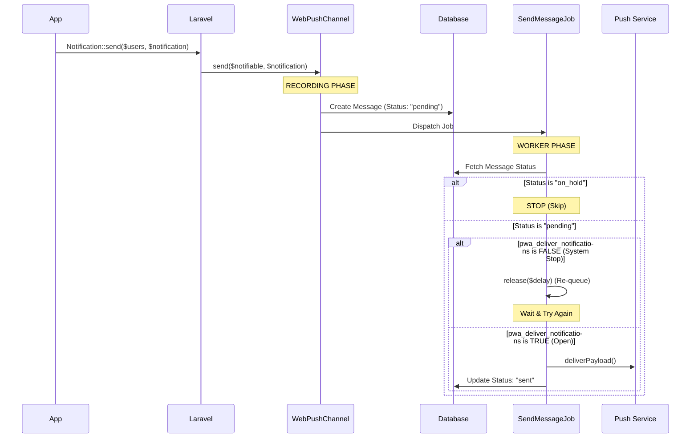

# BeeGoodIT Laravel PWA

Progressive Web App support for Laravel with Manifest, Service Worker, and **Web Push Notifications**.

### Web Push Notifications
This package provides a built-in notification channel and a set of UI components to handle the subscription process.

#### 1. Push Subscription Logic
The package automatically handles subscription storage and removal via the `PushSubscriptionController`.
By default, subscriptions are linked to the authenticated user.

#### 2. Early Push Prompt (Soft Prompt)
Modern PWA standards recommend a **"Two-Step Opt-in"** process. Instead of showing the browser's native (and uncustomizable) permission prompt on page load, use a **Soft Prompt** (Teaser) to explain the value of notifications.

---

## Architecture & Data Flow

The system is designed as an **Intelligent Recorder and Worker**. It leverages Laravel's native notification system but interjects a tracking and control layer.

### Data Flow (Decoupled Delivery)



---

## System Control

### 1. Delivery Gate (Global Switch)
The system has a global "Delivery Gate" controlled by the `pwa_deliver_notifications` setting.
- **Enabled**: Workers process notifications immediately.
- **Disabled**: Workers will re-queue jobs with a delay, effectively pausing all PWA delivery without losing data or changing message statuses.

**Control Options:**
- **Filament**: Use the **Notification Settings** page in the Admin panel.
- **Artisan**: `php artisan pwa:toggle-system off|on`

### 2. Manual Management
Admins have full control over recorded messages and broadcasts:
- **Messages**: Edit content (title/body), manually toggle `on_hold`/`pending` status, or delete records entirely (even if sent).
- **Broadcasts**: Hold or release ALL pending messages for a specific broadcast at once, delete broadcasts (cascading to messages), or resend completed broadcasts.

---

## Installation

```bash
composer require beegoodit/laravel-pwa
```

## Setup

### 1. Add Trait to User Model
Add the `HasPushSubscriptions` trait to your `App\Models\User` model.

### 2. Publish and Migrate
```bash
php artisan vendor:publish --tag=pwa-config
php artisan vendor:publish --tag=pwa-migrations
php artisan migrate
```

### 3. Generate VAPID Keys
```bash
php artisan pwa:vapid-keys
```

### 4. Filament Integration
Register the `LaravelPwaPlugin` in your `PanelProvider`:

```php
->plugins([
    \BeegoodIT\LaravelPwa\Filament\LaravelPwaPlugin::make(),
])
```

This will automatically register:
- **Notification Settings**: Control global delivery.
- **Broadcasts**: Send manual bulk notifications.
- **Messages**: Detailed delivery log and manual hold/release controls.
- **Subscriptions**: Transparency into active browser clients and diagnostic tests.

## Features
- ✅ **PWA manifest.json** installation support
- ✅ **Push Notifications** via Web Push (VAPID)
- ✅ **Decoupled Worker** with Global Pause & Manual Hold
- ✅ **Diagnostics** with "Send Test Notification" action
- ✅ **Service Worker** with caching and offline support

## License
MIT License.
