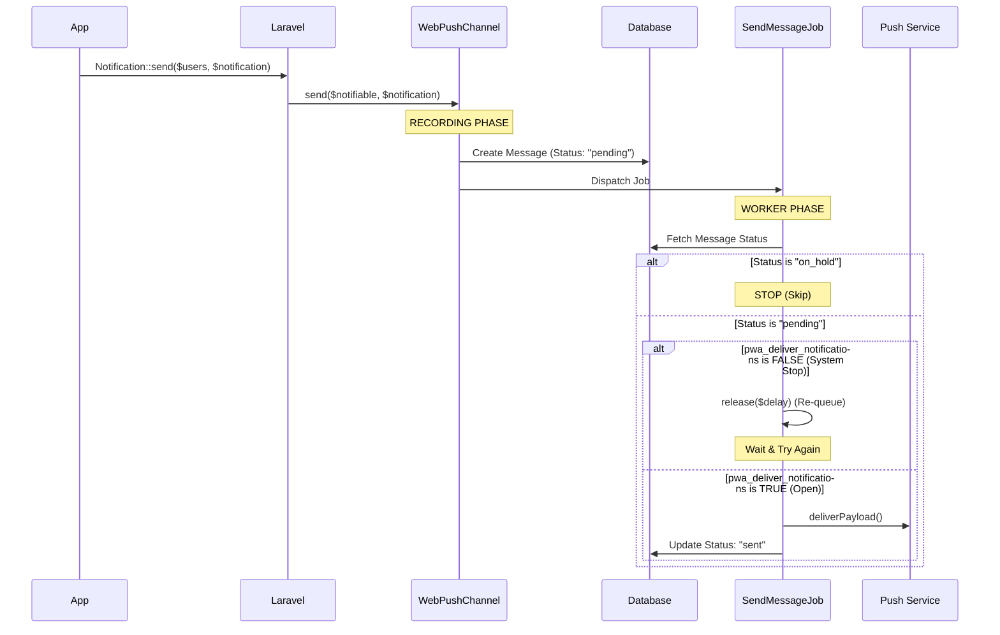

# BeeGoodIT Laravel PWA

Progressive Web App support for Laravel with Manifest, Service Worker, and **Web Push Notifications**.

### Web Push Notifications
This package provides a built-in notification channel and a set of UI components to handle the subscription process.

#### 1. Push Subscription Logic
The package automatically handles subscription storage and removal via the `PushSubscriptionController`.
By default, subscriptions are linked to the authenticated user.

#### 2. Early Push Prompt (Soft Prompt)
Modern PWA standards recommend a **"Two-Step Opt-in"** process. Instead of showing the browser's native (and uncustomizable) permission prompt on page load, use a **Soft Prompt** (Teaser) to explain the value of notifications.

---

## Architecture & Data Flow

The system is designed as an **Intelligent Recorder and Worker**. It leverages Laravel's native notification system but interjects a tracking and control layer.

### Data Flow (Decoupled Delivery)


```mermaid
sequenceDiagram
    participant App
    participant Laravel
    participant PWA_C as WebPushChannel
    participant PWA_DB as Database
    participant PWA_J as SendMessageJob
    participant Push as Push Service

    App->>Laravel: Notification::send($users, $notification)
    Laravel->>PWA_C: send($notifiable, $notification)
    
    Note over PWA_C: RECORDING PHASE
    PWA_C->>PWA_DB: Create Message (Status: "pending")
    PWA_C->>PWA_J: Dispatch Job
    
    Note over PWA_J: WORKER PHASE
    PWA_J->>PWA_DB: Fetch Message Status
    
    alt Status is "on_hold"
        Note over PWA_J: STOP (Skip)
    else Status is "pending"
        alt pwa_deliver_notifications is FALSE (System Stop)
            PWA_J->>PWA_J: release($delay) (Re-queue)
            Note over PWA_J: Wait & Try Again
        else pwa_deliver_notifications is TRUE (Open)
            PWA_J->>Push: deliverPayload()
            PWA_J->>PWA_DB: Update Status: "sent"
        end
    end
```

---

## System Control

### 1. Delivery Gate (Global Switch)
The system has a global "Delivery Gate" controlled by the `pwa_deliver_notifications` setting.
- **Enabled**: Workers process notifications immediately.
- **Disabled**: Workers will re-queue jobs with a delay, effectively pausing all PWA delivery without losing data or changing message statuses.

**Control Options:**
- **Filament**: Use the **Notification Settings** page in the Admin panel.
- **Artisan**: `php artisan pwa:toggle-system off|on`

### 2. Manual Management
Admins have full control over recorded messages and broadcasts:
- **Messages**: Edit content (title/body), manually toggle `on_hold`/`pending` status, or delete records entirely (even if sent).
- **Broadcasts**: Hold or release ALL pending messages for a specific broadcast at once, delete broadcasts (cascading to messages), or resend completed broadcasts.

---

## Installation

```bash
composer require beegoodit/laravel-pwa
```

## Setup

### 1. Add Trait to User Model
Add the `HasPushSubscriptions` trait to your `App\Models\User` model.

### 2. Publish and Migrate
```bash
php artisan vendor:publish --tag=pwa-config
php artisan vendor:publish --tag=pwa-migrations
php artisan migrate
```

### 3. Generate VAPID Keys
```bash
php artisan pwa:vapid-keys
```

### 4. Filament Integration
Register the `LaravelPwaPlugin` in your `PanelProvider`:

```php
->plugins([
    \BeegoodIT\LaravelPwa\Filament\LaravelPwaPlugin::make(),
])
```

This will automatically register:
- **Notification Settings**: Control global delivery.
- **Broadcasts**: Send manual bulk notifications.
- **Messages**: Detailed delivery log and manual hold/release controls.
- **Subscriptions**: Transparency into active browser clients and diagnostic tests.

### 5. Optional: PWA navigation (bottom bar + menu sheet)

For standalone PWA mode, the browser hides the URL bar. You can add an in-app bottom navigation bar and slide-up menu using the `<x-pwa::nav>` component.

**Styles are bundled** — include `@pwaStyles` once in your layout `<head>`. No Tailwind build is required for the bar, sheet, backdrop, or transitions. CSS is served from the package automatically (or from `public/css/` if you published assets).

```blade
<head>
    @pwaHead
    @pwaStyles
</head>
```

When `LaravelPwaPlugin` is registered, Filament panels also receive `@pwaStyles` automatically (`navigation.register_filament_styles`).

#### Requirements

The nav uses **Alpine.js** for the menu sheet. Load Alpine before the component mounts:

| Surface | What you need |
|---------|----------------|
| **Public / guest layouts** | `@livewireScripts` and `@filamentScripts(withCore: true)` |
| **Filament panels** | Filament/Livewire scripts — inject nav on `PanelsRenderHook::SCRIPTS_BEFORE` |

#### Setup

1. **Configure bar items** in `config/pwa.php` under `navigation.bar`.
2. **Include the component** and pass the **menu** slot (before scripts on public pages):

```blade
<x-pwa::nav :items="$items" :menu-title="__('Menu')">
    <x-slot:menu>...</x-slot:menu>
</x-pwa::nav>

@livewireScripts
@filamentScripts(withCore: true)
```

Icons use Filament Heroicons when available; otherwise bundled SVG fallbacks are used.

#### Theming

The nav reads **app-owned `--pwa-*` CSS tokens** on `:root` and `.dark`. Define them in app CSS loaded **before** `@pwaStyles` (e.g. import `pwa-tokens.css` in `app.css`). The package does **not** set tokens on `:root` — only scoped zinc fallbacks on `.pwa-nav` when tokens are absent — so app tokens are never overwritten. Config `navigation.theme_tokens` is injected **after** `pwa-nav.css` for overrides. Dark mode follows the `.dark` class on `<html>` (Filament's theme picker) — not `prefers-color-scheme`.

**Recommended:** define tokens once in your app CSS (import the same file in public CSS and Filament theme if both surfaces show the nav):

```css
/* resources/css/pwa-tokens.css */
:root {
    --pwa-surface: rgba(255, 255, 255, 0.9);
    --pwa-surface-border: rgba(228, 228, 231, 0.5);
    --pwa-text-muted: #71717a;
    --pwa-text-hover: #3f3f46;
    --pwa-text-active: #18181b;
    --pwa-sheet-surface: #ffffff;
    --pwa-sheet-title: #18181b;
    --pwa-sheet-border: #e4e4e7;
    --pwa-backdrop: rgba(24, 24, 27, 0.75);
}

.dark {
    --pwa-surface: rgba(24, 24, 27, 0.9);
    --pwa-surface-border: rgba(39, 39, 42, 0.5);
    --pwa-text-muted: #a1a1aa;
    --pwa-text-hover: #d4d4d8;
    --pwa-text-active: #fafafa;
    --pwa-sheet-surface: #18181b;
    --pwa-sheet-title: #fafafa;
    --pwa-sheet-border: #27272a;
    --pwa-backdrop: rgba(9, 9, 11, 0.75);
}
```

**Brand accent only** — override active/hover tokens:

```css
:root {
    --pwa-text-active: #f59e0b;
    --pwa-text-hover: #d97706;
}
```

**Config escape hatch** (when you cannot edit CSS yet): `config/pwa.php` → `navigation.theme_tokens`:

```php
'theme_tokens' => [
    'light' => ['text-active' => '#f59e0b'],
    'dark' => ['text-active' => '#fbbf24'],
],
```

Keys map to `--pwa-{key}` (e.g. `surface`, `text-muted`, `sheet-border`).

Legacy Tailwind class overrides (`bar_class`, `sheet_panel_class`, `active_color_class`, …) remain supported but are deprecated — prefer tokens or a published Blade override you maintain yourself.

#### Migration (navigation theming)

`navigation.colors` was removed. There is no backwards compatibility shim.

| Before | After |
|--------|-------|
| `'colors' => ['active' => '#2563eb']` | `'--pwa-text-active: #2563eb'` in app CSS **or** `'theme_tokens' => ['light' => ['text-active' => '#2563eb']]` |
| Hardcoded amber/blue in package CSS | Package zinc fallbacks; app sets `--pwa-*` tokens |
| Published `vendor/laravel-pwa/components/pwa-nav.blade.php` with Tailwind | Delete override; use `<x-pwa::nav>` + tokens (Tier A) |
| `active_color_class => 'text-amber-500'` | `--pwa-text-active` token |

**Integration tiers**

| Tier | Setup |
|------|--------|
| **A — Standard** | `<x-pwa::nav>`, `@pwaStyles`, define `--pwa-*` in app CSS, empty `theme_tokens` |
| **B — Branded accent** | Tier A + override `--pwa-text-active` / `--pwa-text-hover` only |
| **C — Fully custom** | Published Blade override — you own all styling; package provides icons/helpers only |

**After upgrading**

1. Remove `navigation.colors` from `config/pwa.php`.
2. Add `resources/css/pwa-tokens.css` (or equivalent) and import it wherever the nav appears.
3. Hard refresh or unregister the service worker — asset URLs now include `?v={mtime}` but bump `CACHE_NAME` in `public/sw.js` if you cache CSS aggressively.

#### Filament render hook

Register on `PanelsRenderHook::SCRIPTS_BEFORE` (not `BODY_END`).

### 5b. PWA navigation troubleshooting

| Symptom | Fix |
|---------|-----|
| Menu sheet always visible / button dead | Load Alpine; use `SCRIPTS_BEFORE` on Filament |
| Bar/sheet unstyled | Add `@pwaStyles` to `<head>` |
| Nav colors wrong after upgrade | Define `--pwa-*` tokens in app CSS before `@pwaStyles`; remove old `navigation.colors`; hard refresh / bump SW cache |
| App `--pwa-*` tokens ignored | Import tokens before `@pwaStyles`; package no longer sets `:root` fallbacks that override app CSS |
| Nav dark in light mode (stale CSS) | Hard refresh; `@pwaStyles` URLs are cache-busted with `?v=` |

### 5a. Optional: PWA top nav (header)

For a fixed top bar (e.g. logo + actions), use `<x-pwa::header>`. Pass your content via the default slot. The component adds `padding-top` to `main`, `.fi-main`, and `.fi-sidebar` so content clears the header; control it via `config/pwa.php` → `header.padding_top`. Customize the bar look with `header.header_class`.

```blade
<x-pwa::header>
    <nav class="container mx-auto px-4 sm:px-6 py-4 flex items-center justify-between">
        <a href="{{ url('/') }}" class="font-bold text-gray-900 dark:text-white">{{ config('app.name') }}</a>
        <a href="{{ url('/admin') }}" class="text-sm font-medium text-amber-600 dark:text-amber-400">{{ __('Dashboard') }}</a>
    </nav>
</x-pwa::header>
```

Config: `pwa.header.header_class` (Tailwind classes for the bar), `pwa.header.padding_top` (e.g. `5rem` or `6rem`).

## Features
- ✅ **PWA manifest.json** installation support
- ✅ **Push Notifications** via Web Push (VAPID)
- ✅ **Decoupled Worker** with Global Pause & Manual Hold
- ✅ **Diagnostics** with "Send Test Notification" action
- ✅ **Service Worker** with caching and offline support

## License
MIT License.
